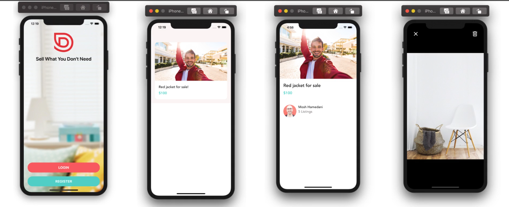

# Welcome to Jibobi3 your mobile sell app 👋

## Get started

1. Install dependencies

   ```bash
   npm install
   npx expo install react-dom react-native-web @expo/metro-runtime
   ```

2. Start the app

   ```bash
    npx expo start
   ```


3. unstall package 

   ```bash
            npm uninstall package 

   ```


4. cheack updates of installed packages 

   ```bash
             npx expo install --check 
             //then it asks you to  do the nesusary  update or not 

   ```


## presentation of the app 



## vs code snippet

go to file/preferences/configure snippet chose the languege and crete your own snippet

